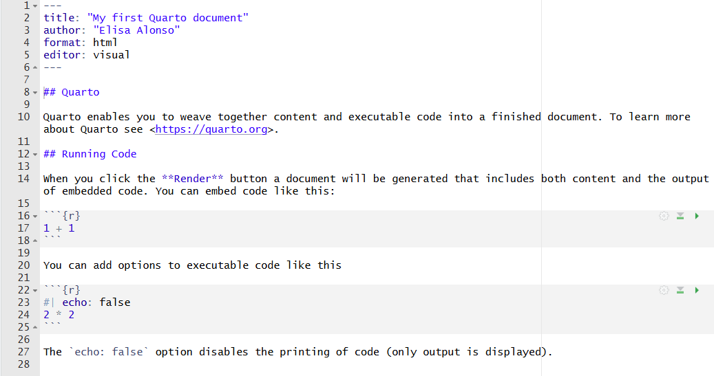

```{r}
#| label: setup
#| include: false
library(tidyverse)
library(kableExtra)
knitr::opts_chunk$set(warning = FALSE, message = FALSE)
```

## Overview {.smaller}
<!-- ====================================================================== -->

::: {.columns}
::: {.column width="50%"}
**1. The Basics of Quarto**

- 1.1. What is Quarto?
- 1.2. Setup: RStudio vs. VS Code
- 1.3. Anatomy of a `.qmd` file
- 1.4. More features
- 1.5. Rendering

**2. What can we create with Quarto?**

- 2.1. Article and reports
- 2.2. Presentations
- 2.3. Dashboards
- 2.4. Websites
- 2.5. Books
:::

::: {.column width="50%"}
**3. Creating a presentation**

- 3.1. Revealjs YAML
- 3.2. Columns
- 3.3. Incremental reveals & speaker notes


**4. Wrap-up & Resources**
:::
:::


# 1. The Basics of Quarto
<!-- ====================================================================== -->

## 1.1 What is Quarto? <!----------------------------------->
- **Quarto** is a publishing system that allows you to both **write text** and **run code** (R/Python/Julia) in the same document
  - Great for **data science** and **reproducible research**!
- Successor to R Markdown, from the same team at Posit
- You can create many different documents: [article and reports](https://quarto.org/docs/output-formats/all-formats.html), [presentations](https://quarto.org/docs/presentations/), [dashboards](https://quarto.org/docs/dashboards/), [websites](https://quarto.org/docs/websites/), [books](https://quarto.org/docs/books/), and more!
  - And in different formats depending on the type of *document*: HTML, PDF, Word, PowerPoint, Beamer, Revealjs...


## 1.2 Setup: RStudio vs. VS Code[^other] <!----------------------->
::: {.columns}
::: {.column width="50%"}
**RStudio**

- Install [R (CRAN)](https://cran.r-project.org/)
- Install [RStudio Desktop](https://docs.posit.co/ide/user/)
- Quarto is already **bundled** in RStudio!
:::

::: {.column width="50%"}
**VS Code**

- Install [R (CRAN)](https://cran.r-project.org/)
- Install [VS Code](https://code.visualstudio.com/)
- Install the [**Quarto CLI**](https://quarto.org/docs/get-started/installation.html) separately
- Install the [**Quarto extension**](https://marketplace.visualstudio.com/items?itemName=quarto.quarto)
:::
:::

[^other]: Other options include: Jupyter, Positron, Neovim, any text editor

## 1.3 Anatomy of a `.qmd` file <!----------------------->

::: {.columns}
::: {.column width="25%"}
<p style="font-size:0.7em; margin-top:0.5cm; margin-bottom:1.6cm;"><b>YAML header &#10140;</b></p>
<p style="font-size:0.7em; margin-bottom:2.3cm;"><b>Text &#10140;</b></p>
<p style="font-size:0.7em; margin-bottom:1cm;"><b>&nbsp;</b></p>
<p style="font-size:0.7em; margin-bottom:1cm;"><b>Code chunk &#10140;</b></p>
:::
::: {.column width="75%"}
<center></center>
:::
:::

## 1.3 Anatomy: YAML header <!----------------------->

- The YAML header is a **metadata block** that tells Quarto how to render the document. 
- It **must** be enclosed by three dashes (`---`) at the top and bottom
- It **must** be the first thing in the file (no blank lines or comments above it)
- It accepts **many options** depending on the output format (HTML, PDF, slides, etc.)


```yaml
---
title: "My first Quarto document"
author: "Elisa Alonso-Herrero"
date: today
format: html
---
```

## 1.3 Anatomy: YAML header {.smaller}

**General options** (any document type)

- `title`, `author`, `date` — document metadata
- `format` — output type: `html`, `pdf`, `docx`, `revealjs`, `beamer`...
- `execute:` — code execution options (`echo`, `warning`, `message`...)
- `bibliography`, `csl` — citations and citation style

**Format-specific options** — nested under `format:`

::: {.columns}
::: {.column width="50%"}
*Reports* (`html`, `pdf`, `docx`)

- `toc: true` — table of contents
- `number-sections: true`
- `code-fold: true` — collapsible code
:::

::: {.column width="50%"}
*Presentations* (`revealjs`, `beamer`)

- `slide-number: true`
- `transition` — slide transition style
- `incremental: true` — reveal bullets one at a time
:::
:::

## 1.3 Anatomy: Text <!----------------------->

- Quarto uses (Pandoc) **Markdown** for text formatting, which relies on symbols to indicate formatting (e.g. for headings, **bold** or *italics*)
- Mathematical expressions can be written in **LaTeX**
- You can also include HTML tags for more advanced formatting

## 1.3 Anatomy: Text {.smaller}

::: {.columns}
::: {.column width="50%"}
<center><h4>Syntax</h4></center>

`Plain text`

`End a line with two spaces for a line break`

`*italics*`

`**bold**`
<br>

`# Header 1`
<br><br>

`## Header 2`

`###### Header 6`

`[link](https://quarto.org)`
:::

::: {.column width="50%"}
<center><h4>Output</h4></center>

Plain text

End a line with two spaces for a line break

*italics*

**bold**

<div style="font-size:2em; font-weight:bold; margin:0.3em 0;">Header 1</div>

<div style="font-size:1.5em; font-weight:bold; margin:0.3em 0;">Header 2</div>

<div style="font-size:0.85em; font-weight:bold; margin:0.3em 0;">Header 6</div>

[link](https://quarto.org)
:::
:::


## 1.3 Anatomy: Code chunks <!----------------------->

- **Code chunks are blocks of R code** that can be run when working on and rendering the .qmd file
-  You can insert a code chunk using a shorcut (e.g. `Ctrl + Alt + i` in R Studio) or by typing the **backticks chunk delimiters** as follows

```{r}
1+1
```


## 1.3 Anatomy: Code chunks <!----------------------->

The content to be displayed in the output document can be controlled with [**chunk options**](https://quarto.org/docs/computations/execution-options.html)

```{r, echo = F}
kable(tibble(Option = c("eval", "echo", "warning", "error", "message", 
                         "fig.width", "fig.height"),
             Default = c("TRUE", "TRUE", "TRUE", "TRUE", 
                         "TRUE", "7", "7"),
             Effect = c("Whether to evaluate the code and include its results", 
             "Whether to display code along with its results", 
             "Whether to display warnings", 
             "Whether to display errors", 
             "Whether to display messages", 
             "Width in inches for plots created in chunk", 
             "Height in inches for plots created in chunk")), caption = "", align = "lcl") %>%
  row_spec(0, align = "c")
```

## 1.3 Anatomy: Code chunks <!----------------------->

- For an option to apply to the **whole document**, set it up in the YAML header:

````YAML
---
title: "My first Quarto document"
format: html
execute:
  echo: false
  warning: false
---
````

- For an option to apply to a **specific chunk**, two possibilities:

::: {.columns}
::: {.column width="50%"}
<center><h4>Chunk header</h4></center>

`````markdown
```{{r, echo = false, warning = false}}
1 + 1
```
`````
:::

::: {.column width="50%"}
<center><h4>Pipe (<code>#|</code>) options</h4></center>

`````markdown
```{{r}}
#| echo: false
#| warning: false
1 + 1
```
`````
:::
:::

## 1.4 More features: Including tables  <!----------------------->

- Two ways to include tables in a `.qmd` file:

::: {.columns}
::: {.column width="50%"}
**Markdown**

```markdown
| Col A | Col B |
|-------|-------|
| 1     | 2     |
| 3     | 4     |
```
:::

::: {.column width="50%"}
**R**

```{{r}}
knitr::kable(head(mtcars))
```
:::
:::

- Markdown tables are simple but static; tables built **in R** (or Python) can be generated from data and styled with packages like `kableExtra`, `huxtable` or `gt`

## More features: Including figures [^more-fig]  <!----------------------->

- Figures can come from a **code chunk** (e.g. a `ggplot2` plot) or be **inserted directly** with Markdown image syntax
- Chunk options control figure appearance: `fig-width`, `fig-height`, `fig-cap`, `fig-align`...


```{{r}}
#| label: fig-scatter
#| fig-cap: "Fuel efficiency vs. weight"
ggplot(mtcars, aes(wt, mpg)) + geom_point()
```

```markdown
# Markdown syntax for an image:

```

[^more-fig]:See [R for Data Science — Figures](https://r4ds.hadley.nz/quarto.html#sec-figures) for more details

## 1.4 More features: Including citations [^more-citations] <!----------------------->

- Add a `bibliography` file (e.g. `.bib`) to the YAML header, then cite with `@key`

```yaml
---
bibliography: references.bib
---
```

```markdown
As shown by @wickham2016, ...
```

- Quarto automatically generates a **reference list** at the end of the document

[^more-citations]: See [R for Data Science — Bibliographies & Citations](https://r4ds.hadley.nz/quarto.html#bibliographies-and-citations) for more details

## 1.4 Rendering <!----------------------->

- You can **create the final document** by clicking **Render** in RStudio or **Preview** in VS Code

- **What happens in the background?** Quarto hands the file to **knitr** (or Jupyter) to run the code and capture its output, then passes the resulting Markdown to **Pandoc**, which renders it into the final format (HTML, PDF, Word...)

{width="700" fig-align="center"}

## 1.4 Rendering: [**multiple formats**](https://quarto.org/docs/output-formats/all-formats.html)

- The `format` YAML field specifies **how** to render the document, and you can list **more than one format** to render the same `.qmd` file multiple ways[^pdf]

```yaml
---
title: "My first Quarto document"
format:
  html:
    toc: true
  pdf:
    number-sections: true
---
```

- The **first format listed** is used by default when you click **Render**; to render a specific one instead:

```bash
quarto render doc.qmd --to pdf
```

[^pdf]: PDF output requires a TeX distribution to be installed on your system. If you don't have any, run `quarto install tinytex` in the terminal


## 1.4 Rendering: caching & self-contained files [^more-rendering] {.smaller}

**Caching**

- `cache: true` (in the YAML or a chunk) tells `knitr` to **save chunk results** and skip re-running code that hasn't changed on the next render — useful for slow chunks (e.g. heavy models, big data)
- Cache is invalidated automatically if the chunk's code changes
- See [R for Data Science — Caching](https://r4ds.hadley.nz/quarto.html#sec-caching) for more details

**Self-contained (embedded) files**

- By default, HTML output can depend on **external files** (images, JS, CSS) alongside the `.html`
- `embed-resources: true` bundles everything into a **single, portable HTML file** — easier to share, but a larger file

```yaml
format:
  html:
    embed-resources: true
```

[^more-rendering]: See [R for Data Science — YAML header](https://r4ds.hadley.nz/quarto.html#yaml-header) for more details

# 2. What can we create with Quarto?
<!-- ====================================================================== -->

## 2.1 Articles & Reports ⭐ <!----------------------->

- Basic documents (`.qmd` → HTML, PDF, or Word) for **analyses, papers, and reports**
- Great for exploratory analysis! E.g. That's how I prepare meetings with my supervisor

**Examples:**

- "My first Quarto document" that you created before 
- [Sample HTML report](https://quarto.org/docs/output-formats/html-basics.html) or a [HTML report with fancier layout](https://quarto-dev.github.io/quarto-gallery/page-layout/tufte.html)

## 2.2 Presentations <!----------------------->

- Multiple engines: **Revealjs** (HTML, like this deck!), **Beamer** (PDF), **PowerPoint**
- `##` headings become slides; `#` headings become section dividers
- Personal take: useful for TA sessions, but not worth switching from Beamer for anything else

**Examples:**

- [Intro to Econometrics and R](https://louissirugue.github.io/metrics_on_R/lecture10/slides.html#1) by [Louis Sirugue](https://louissirugue.github.io/metrics_on_R/) (technically R Markdown, but you can do the same in Quarto)

## 2.3 Dashboards <!----------------------->

- Arrange plots, tables, and value boxes into a **grid layout**
- Row/column layout is controlled with `##` and `###` headings plus `{.tabset}`/orientation options
- Can be **static** (rendered once) or **interactive** (via Shiny/Observable)

**Examples:**

- [Quarto dashboards gallery](https://quarto.org/docs/gallery/#dashboards)
- [Labor and delivery dashboards](https://mine-cetinkaya-rundel.github.io/ld-dashboard/)

## 2.4 Websites ⭐ <!----------------------->

- Multiple `.qmd` pages linked together via a **navbar/sidebar**, defined in `_quarto.yml`
- Great for **course pages, personal sites, or project docs**
- `quarto preview` gives a live-reloading local server while you build

**Examples:**

- [Quarto websites gallery](https://quarto.org/docs/gallery/#websites)
- Course/workshop sites: [Julia Workship](https://crsl4.github.io/julia-workshop/), [STA 210](https://sta210-s22.github.io/website/)
- Personal sites: [Mike Mahoney](https://www.mm218.dev/)

## 2.5 Books ⭐ <!----------------------->

- Like websites, but organized into **chapters** with automatic numbering, a shared bibliography, and cross-chapter references
- Renders to a full site **and** PDF/EPUB from one source

**Examples:**

- [Quarto books gallery](https://quarto.org/docs/gallery/#books)
- [R for Data Science](https://r4ds.hadley.nz/)


# 3. Creating a presentation
<!-- ====================================================================== -->
## 3.1 A new document type: Revealjs presentations
- A slide deck is usually the second document you create in Quarto, after a simple report.
- Quarto lets you create interactive presentations using a combination of Markdown and **Revealjs**
  - Yet another thing to learn... but the syntax is not too hard

## 3.1 Revealjs YAML

```yaml
---
format:
  revealjs:
    theme: simple
    slide-number: true
    transition: fade
    incremental: false
---
```

- `theme` — visual theme (see themes slide)
- `slide-number: true` — show slide numbers
- `transition` — animation between slides: `none`, `fade`, `slide`, `convex`, `concave`, `zoom`
- `incremental: true` — bullets reveal one at a time by default (can be overridden per-list)

## 3.1 Main syntax: headings → slides

- `##` (level-2 heading) starts a **new slide**
- `#` (level-1 heading) makes a **big section divider** — like the slides introducing each part of this workshop
- `###` (level-3) creates a **sub-slide**, stacked vertically under the previous `##` slide

```markdown
# Section title

## A slide

### A vertical sub-slide, nested under "A slide"
```

## 3.2 Columns

::: {.columns}
::: {.column width="50%"}
```markdown
::: {.columns}
::: {.column width="50%"}
Left content
:::
::: {.column width="50%"}
Right content
:::
:::
```
:::
::: {.column width="50%"}
This is what it looks like rendered — you're reading the output of the exact code on the left.
:::
:::

## 3.3 Incremental reveals

- Wrap a list in `{.incremental}` to reveal bullets **one at a time** on click

::: {.columns}
::: {.column width="50%"}
```markdown
::: {.incremental}
- Bullet one
- Bullet two
- Bullet three
:::
```
:::
::: {.column width="50%"}
::: {.incremental}
- Bullet one
- Bullet two
- Bullet three
:::
:::
:::

## 3.3 Fragment styles

- `{.fragment}` reveals **any element** (not just list items) on click — text, images, code blocks...
- Add a **fragment style class** to change *how* it appears:

::: {.columns}
::: {.column width="50%"}
```markdown
::: {.fragment}
Fades in (default)
:::

::: {.fragment .fade-up}
Slides up
:::

::: {.fragment .highlight-red}
Highlights red
:::

::: {.fragment .shrink}
Shrinks
:::
```
:::
::: {.column width="50%"}
::: {.fragment}
Fades in (default)
:::

::: {.fragment .fade-up}
Slides up
:::

::: {.fragment .highlight-red}
Highlights red
:::

::: {.fragment .shrink}
Shrinks
:::
:::
:::

## 3.3 Speaker notes

- Add notes only **you** can see, shown in Speaker View (press **"S"** during the presentation)

```markdown
::: {.notes}
Only you see this, in Speaker View.
:::
```

## 3.4 Slide-level styling options {.smaller}

- Attributes go in `{}` right after the heading text:

| Class | Effect |
|---|---|
| `{.smaller}` | shrinks content to fit more on the slide |
| `{.scrollable}` | makes overflowing content scrollable instead of clipped |
| `{.center}` | vertically centers slide content |
| `{background-color="..."}` | sets a custom background color for that slide |
| `{background-image="..."}` | sets a custom background image for that slide |

```markdown
## A packed slide {.smaller .scrollable}
```

## 3.4 Themes

- Revealjs ships with **built-in themes** — just set `theme:` in the YAML

```yaml
format:
  revealjs:
    theme: simple   # or: default, dark, sky, beige, serif, solarized...
```

- Browse them all: [Revealjs theme gallery](https://quarto.org/docs/presentations/revealjs/themes.html)
- You can also supply a **custom `.scss` file** for full control over colors, fonts, and spacing:

```yaml
format:
  revealjs:
    theme: [default, custom.scss]
```


<!--


# 4. Document Type 2 — Presentation

::: {.notes}
Timing: ~10 min. This slide deck IS the demo — say that explicitly, then build 2-3 new slides live from scratch.
:::

## You're looking at one right now

```yaml
format:
  revealjs:
    theme: simple
    slide-number: true
    transition: fade
```

Each `##` heading starts a new slide. `#` (single hash) makes a big section divider — like the slides introducing each part of this workshop.

## Columns, live

::: {.columns}
::: {.column width="50%"}
```markdown
::: {.columns}
::: {.column width="50%"}
Left content
:::
::: {.column width="50%"}
Right content
:::
:::
```
:::
::: {.column width="50%"}
This is what it looks like rendered — you're reading the output of the exact code on the left.
:::
:::

## Incremental reveals & speaker notes

::: {.incremental}
- Bullet one
- Bullet two
- Bullet three
:::

```markdown
::: {.notes}
Only you see this, in Speaker View (press "S").
:::
```

# 6. Wrap-up & Resources

::: {.notes}
Timing: ~5 min. Genuine buffer — let this absorb any overrun from earlier sections.
:::

## Where to go next

- **Docs**: quarto.org/docs
- **Cheat sheet**: rstudio.github.io/cheatsheets → Quarto
- **Extensions gallery**: quarto.org/docs/extensions — confetti, fullscreen code, and more for revealjs
- **Gallery of real examples**: quarto.org/docs/gallery

## Thank you! {.center}

Questions?
[your.email@example.com]{.fragment}
-->
